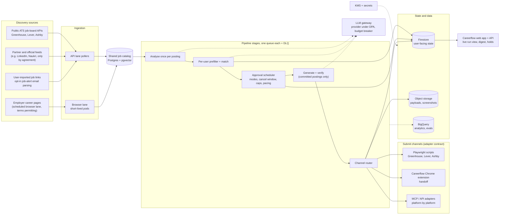
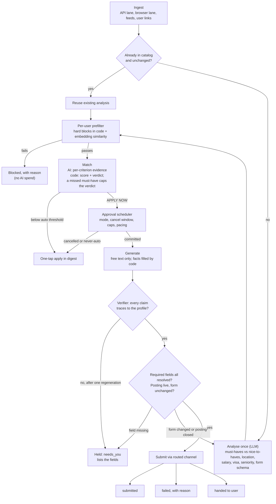
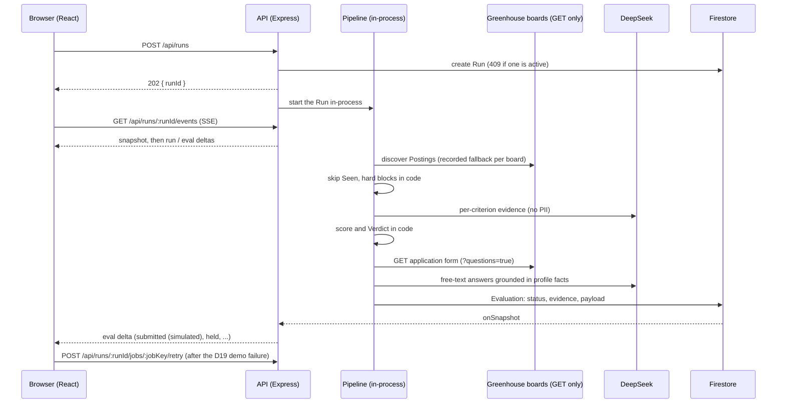

# AI Auto-apply: Technical Design Document

_Careerflow.ai Engineering Manager take-home · 7 Oct 2026_

## Summary

AI Auto-apply is an agent that finds postings, judges each one against the user's own criteria, and applies only where the user is a strong fit. Generic auto-apply tools optimise for volume; this design optimises for **interviews per active user per week**, and it holds back anything it cannot answer truthfully rather than guessing. In production, each posting is ingested and analysed **once** into a shared catalog, then matched per user (code applies hard blocks and computes the score from AI-supplied, quoted evidence), and only postings committed to submit pay for text generation and a browser. The system scales by putting a queue in front of every stage and running browsers in short-lived pods, and a per-user daily cost budget sets the caps. The prototype that accompanies this document implements the core of that pipeline end to end on Greenhouse with a **simulated** submit; Section 8 lists exactly what it does and does not do.

**How to read this document.** Sections 1–7 describe the production design. Section 7 is the risk assessment (brief deliverable 4). Section 8 maps the design onto the prototype that exists in this repository, and Section 9 is future work. Appendix A holds the business notes that shaped some technical choices. Numbers marked _assumption_ are planning estimates, not measurements.

---

## 1. Feature overview

### Purpose

An agent that finds, scores and applies to postings on the user's behalf. It applies only where the user is a strong fit and hands the user anything it cannot answer truthfully. A 70% match that misses the one real must-have counts as a no.

### Target users

- **Pilot:** active applicants already on Careerflow, on a free two-week trial. Their resumes and tracker data make onboarding cheap.
- **Next segment:** passive paying users who send 2–3 applications a week and want to make sure they never miss a strong match.

### Product behaviour

- After a structured onboarding interview, auto-apply runs from day one for high-confidence matches. Lower-confidence matches get one-tap apply.
- Each user picks an **approval mode**: auto-approve after a timer, add to a queue for review, or never auto-apply.
- Every pending submit has a **cancel window**, and a **daily digest** goes out at a time the user chooses.
- Every run and digest shows the **funnel** (scanned → relevant → strong → applied → waiting for you), so filtering reads as work done rather than inactivity.

### Expected outcomes and metrics

| Kind                    | Metric                                                                                                                                     |
| ----------------------- | ------------------------------------------------------------------------------------------------------------------------------------------ |
| North star              | Interviews per active user per week                                                                                                        |
| Guardrails              | Interview rate per application, compared with the user's own manual baseline; override rate (user cancels or edits); time to resolve holds |
| Pre-launch quality gate | A golden eval set (Section 3)                                                                                                              |
| Outcome sources         | Tracker status, opt-in inbox parsing, and a 14-day check-in. Attribution is incomplete and the metrics are treated as directional.         |

**Rejection feedback.** For each rejection we capture the stage and the reason (location, salary, a key skill). These become new hard blocks and rubric changes.

---

## 2. System architecture

### Components

| Component                          | Responsibility                                                                                                                                                                                             |
| ---------------------------------- | ---------------------------------------------------------------------------------------------------------------------------------------------------------------------------------------------------------- |
| **Ingestion, API lane**            | Polls public ATS job-board APIs (GET only) at whatever rate each allows, plus any partner feeds, user-imported links and opt-in job-alert emails.                                                          |
| **Ingestion, browser lane**        | Scheduled scans, a few times a day, of employer career pages that have no API, where the site's terms allow it. Each browser runs in its own short-lived pod.                                              |
| **Shared job catalog**             | One record per posting, deduplicated by a stable identity (ATS, board, job id), with the analysis output and an embedding.                                                                                 |
| **Analyse**                        | One LLM pass per posting, shared by every user it is matched to (Section 3).                                                                                                                               |
| **Prefilter + match**              | Per user: structured hard blocks plus embedding similarity narrow the catalog, then the AI returns per-criterion evidence and code scores it.                                                              |
| **Approval scheduler**             | Applies the user's approval mode, the cancel window, per-user daily caps, per-posting caps and per-employer pacing.                                                                                        |
| **Generate + verify**              | Writes free text only for postings committed to submit, then checks every claim against the profile.                                                                                                       |
| **Channel router**                 | Picks a submit channel per posting using the platform's terms of service, the measured success rate per platform and channel, and the cost per submit.                                                     |
| **Submit channels**                | Implement one adapter contract (below).                                                                                                                                                                    |
| **Stores**                         | Firestore for user-facing state (runs, evaluations, holds), Postgres with pgvector for the catalog and matching, object storage for payloads and pre-submit screenshots, BigQuery for analytics and evals. |
| **Web app, API and notifications** | Careerflow's existing sign-in (OAuth / SSO), the live run view over SSE, the holds list, and the daily digest by email or push.                                                                            |

### Per-posting pipeline

### Submit-adapter contract

Every channel takes the same **resolved payload** and returns one of three results: **submitted**, **failed with a reason**, or **handed to the user**.

- **v1 channels:** Playwright scripts for Greenhouse, Lever and Ashby, plus a handoff to Careerflow's existing Chrome extension (which also covers ATSs that require a candidate account; see Section 5).
- **v2:** an LLM-driven browser agent for the long tail (Section 9.1).
- **MCP or API adapters:** added platform by platform, each with contract tests and pinned versions (Section 9.2).

The resolved payload is stored on the server. The employer's form is opened only at submit time, after a check that the posting is still live and the form is unchanged. If either check fails, the posting goes back to analysis.

### Discovery-only platforms: LinkedIn, Naukri and similar

**We do not scrape LinkedIn, Naukri or any platform whose terms forbid automated access.** Postings from these platforms enter the catalog only through:

1. **Partnerships or official feeds** offered by the platform;
2. **User-imported job links** that the user pastes or shares into Careerflow;
3. **Opt-in parsing of the user's own job-alert emails** from those platforms.

These postings are used for discovery only. They appear in the digest with an Apply button that opens the employer's own page; the agent never applies on the platform itself. The same rule appears in Section 5 under platform terms.

---

## 3. AI integration

### What the AI sees, and what it never decides

Code owns every decision that can be computed: hard blocks, scoring, the verdict, and every factual form field. The AI is used for judgement over prose (does this posting require X, and where does it say so?) and for free text. This keeps scores reproducible, makes every point traceable to a quote, and means no tokens are spent on postings code has already ruled out.

### Analysing the user profile

The **canonical structured profile** holds facts with evidence, constraints, and standard answers.

- Each field carries its **provenance**: `parsed` (from the resume), `confirmed` (by the user), `learned` (from earlier answers), or, in v2, `assessed` (Section 9.3).
- **Only confirmed fields can be used for an auto-submit.**
- The onboarding interview confirms about 90% (_assumption_) of the fields an application usually asks for. Answers the user gives to `needs_you` holds are stored and reused.

### Analysing job descriptions (once per posting)

One analysis call per posting extracts must-haves vs nice-to-haves, location, salary, visa sponsorship, seniority and the application form schema. The result is stored in the catalog and shared by every user the posting is matched to.

### Matching

1. **Hard blocks in code**: location, remote policy, visa, salary floor and similar rules from the user's preferences.
2. **Per-criterion evidence from the AI**: for each soft criterion, met or not met, with a quote from the posting.
3. **Score and verdict in code**: weights times met criteria. A missed must-have caps the verdict.
4. In v2, a skill the user failed in the assessment cannot count toward an auto-apply verdict, though manual apply stays open.

### Analysing application requirements and generating answers

- **Field resolution.** Every field on the form is resolved from one source: the profile, the user's settings, AI free text, or the user only. Factual fields (name, contact details, work authorisation, notice period) are always filled by code.
- **Generation.** The AI writes free text only, reusing Careerflow's existing cover-letter writer, and only for postings committed to submit. The output schema is built at runtime from the parsed form.
- **Verifier.** A second call traces every claim in the generated text back to the profile. If a claim fails, the answer is regenerated once; if it fails again, the posting is held as `needs_you`.
- **Always human:** employers' AI-policy statements, legal agreements and other anti-bot attestations always go to the user.

### Framework, provider and guardrails

- **Framework.** Production adopts a framework (LangChain) for retrieval and for guardrails at three points: input checks on job descriptions (prompt injection), PII handling on resumes, and output verification. A provider-swappable interface sits underneath it. The prototype deliberately skips a framework because it makes only two schema-bound calls (D25).
- **Provider.** A provider that signs a DPA and commits to zero retention and no training on our data (D22). The model never receives the user's name, contact details or address (D23).
- **Prompt injection.** Job descriptions are delimited and labelled as untrusted data, outputs are schema-bound, and any browser agent is restricted to the payload and the ATS domain.

### Evaluation

- **Three eval sets:** match, form-fill (including cases that must be held), and generation.
- **Release gate:** precision on APPLY NOW must not regress; recall may trade down.
- **Shadow mode:** new models run alongside the current one before promotion.
- **LLM-as-judge** on past user-filled data, calibrated against human labels, using a different model family from the generator.

---

## 4. Scaling to millions of users

### Where the load is

The load sits in **browser ingestion and the submit workers**, not in the API. Each browser runs in its own short-lived pod. Browser scans run a few times a day; API sources are polled at whatever rate each allows.

### Capacity estimate

All inputs below are **assumptions** for sizing, to be replaced with pilot data.

| Quantity                                  | Assumption / arithmetic                                                                                                                       | Result                                                 |
| ----------------------------------------- | --------------------------------------------------------------------------------------------------------------------------------------------- | ------------------------------------------------------ |
| Active auto-apply users                   | _assumption_                                                                                                                                  | 1,000,000                                              |
| Submits per user per day                  | _assumption_                                                                                                                                  | ~3                                                     |
| Submits per day                           | 1,000,000 × 3                                                                                                                                 | 3,000,000                                              |
| Average submits per second                | 3,000,000 ÷ 86,400 s                                                                                                                          | ≈ 35 /s                                                |
| Peak submits per second                   | ≈ 35 × 3 (_assumed_ peak-to-average for business hours)                                                                                       | ≈ 105 /s                                               |
| New or changed postings per day           | _assumption_                                                                                                                                  | 200,000                                                |
| Shared-analysis LLM calls per day         | 200,000 postings × 1 call each                                                                                                                | 200,000 (≈ 2.3 /s)                                     |
| Same, if analysed per user instead        | 1,000,000 users × 50 candidate postings (_assumption_)                                                                                        | 50,000,000, i.e. 250× more                             |
| Match LLM calls per day (after prefilter) | 1,000,000 users × 20 candidates (_assumption_)                                                                                                | 20,000,000 (≈ 230 /s) before batching                  |
| Browser pod-hours per day, submit lane    | 3,000,000 × 70% via server-side Playwright (_assumption_; rest via extension or API) × 60 s per submit (_assumption_) = 126,000,000 s ÷ 3,600 | 35,000                                                 |
| Browser pod-hours per day, ingestion lane | 20,000 career sites (_assumption_) × 3 scans × 60 s = 3,600,000 s ÷ 3,600                                                                     | 1,000                                                  |
| Browser pod-hours per day, total          | 35,000 + 1,000                                                                                                                                | ≈ 36,000 (≈ 1,500 pods on average, ≈ 4,500 at 3× peak) |

The table makes two design choices concrete: analysing each posting once is what keeps analysis cheap, and browsers, not LLM calls or the API, are the dominant compute cost. Moving submits to API or MCP adapters (Section 9.2) is the biggest lever on that cost.

### Queues

- One queue per stage (analyse, match, generate, submit), each with its own **dead-letter queue** and its own autoscaling.
- Technology: **Pub/Sub + Cloud Tasks (proposed; final choice follows Careerflow's existing infrastructure).**
- Rate limits, exponential backoff and circuit breakers apply to every outbound call, including calls to the LLM.

### Pacing and caps

- Submissions are paced **per employer**.
- Each posting has its own **cap on auto-applies**, set per platform. The users selected for it are those with the strongest semantic fit, gathered over a selection window, with priority to users who have had the fewest auto-applies that day. Everyone else gets an Apply button.
- Paid priority for these slots was considered and rejected (Appendix A.7).

### Storage

| Store               | Holds                                                  | Why                                                                     |
| ------------------- | ------------------------------------------------------ | ----------------------------------------------------------------------- |
| Firestore           | User-facing state: runs, evaluations, holds, settings  | Live listeners for the UI, which Careerflow already uses                |
| Postgres + pgvector | The job catalog, analysis output, embeddings, matching | Relational filters and vector similarity in one query for the prefilter |
| Object storage      | Resolved payloads and pre-submit screenshots           | Large, write-once, expiring (Section 5)                                 |
| BigQuery            | Analytics, funnel metrics, eval sets                   | Cheap analytical queries across all users                               |

Database load stays manageable because user-facing writes are per-user documents (no hot shared document), the catalog is read-heavy and indexed for the prefilter, and analytics never queries the operational stores.

### Cost per application

Cost per application = (posting analysis ÷ users it matched) + match call + generation and verification on commit + browser-seconds.

- **Hard ceiling:** ₹80 per user per day: 80% of an illustrative ₹3,000 monthly price, spread over 30 days (Appendix A.6). A circuit breaker enforces it.
- **Design target:** about 30% of revenue, roughly ₹30 per user per day.
- The daily scan and submit caps for each user are derived from this budget.

---

## 5. Security and compliance

### Data flows (GDPR and India's DPDP Act)

- **To the LLM:** only profile facts and job descriptions; never the user's name, contact details or address. The provider must sign a DPA and commit to zero retention and no training on our data.
- **To each ATS:** only the resolved payload for that posting.
- **Embeddings count as personal data** and follow the same retention and deletion rules.

### Encryption and access

- **In transit:** TLS on every hop: browser to API, service to service, and every outbound call to an ATS or the LLM provider.
- **At rest:** all stores encrypted with **KMS-managed keys**. Demographic answers use a separate key (below).
- **User authentication:** OAuth / SSO through Careerflow's existing sign-in; session cookies are `httpOnly`, `Secure` and `SameSite=Strict`.
- **Admin and operator access:** MFA on every admin path, least-privilege IAM, and no standing engineer access to production data.

### Retention and deletion

- Payloads and screenshots are kept for **3 months**, longer only where a named legal obligation requires it.
- **Deleting an account removes everything immediately:** profile, embeddings, payloads, screenshots and eval rows.
- Using a user's data for evals or training needs opt-in, is pseudonymised, and is deleted when the user withdraws consent.

### Permission tiers

1. **Stored and used automatically:** standard profile data. Demographic answers are encrypted under a separate key and replayed exactly as the user gave them.
2. **Shown to the user and accepted with one tap:** legal agreements.
3. **Always answered by a human:** AI-policy and anti-bot attestations.

Major platforms get standing authorisation from the user; new platforms get ad-hoc authorisation.

### Acting on the user's behalf

- **v1 holds no candidate credentials on the server.** ATSs that require an account go through the Chrome extension, in the user's own browser.
- Accounts are never created automatically unless the user explicitly asks for a specific platform.
- If a credential vault is added later, it needs key rotation, least-privilege IAM, audited break-glass access and hardware MFA (Section 9.4).
- Every submit is recorded with who authorised it, and there is a **global pause**.
- The terms split responsibility: the user owns the accuracy of their profile; Careerflow owns submitting exactly what the user approved.

### Platform terms

- **No scraping of platforms whose terms forbid it, including LinkedIn and Naukri.** Their postings come only from partnerships or official feeds, user-imported links, or opt-in parsing of the user's own job-alert emails (Section 2).
- No CAPTCHA solving and no bot-detection evasion.
- Traffic comes from stable egress IPs and stays within published rate limits.
- Contractual partnerships are the preferred route.
- Any change to this policy needs legal sign-off.

### Compliance assurance

- **Periodic compliance audits** (GDPR and DPDP) of data flows, retention jobs, deletion completeness and access logs, plus an independent security review before launch and after any change to credentials or channels.
- A data-processing register lists every processor (LLM provider, cloud, email) with its DPA.

---

## 6. Monitoring and incident response

- **Submit health.** Submit success rate per ATS and per channel, with alerts when it drops; a drop usually means a form changed. Scheduled canary submits run against a test board we control.
- **Pipeline health.** For every stage: queue depth, age of the oldest item, and dead-letter alerts. Each job source's circuit-breaker state is visible.
- **Cost.** AI and browser cost per user, tracked against the daily budget; the breaker trips at the ceiling.
- **Tracing and errors.** End-to-end tracing keyed on run and posting IDs; crash reporting for the API and the workers.
- **Incident response.** The global pause stops all submits; the channel router can disable a channel or platform and fall back to one-tap apply; postings whose form changed are re-analysed rather than retried.

---

## 7. Risk assessment

| Risk                                                       | Probability    | Impact    | Mitigation                                                                                                                                                                                                                                                                                                                                                 |
| ---------------------------------------------------------- | -------------- | --------- | ---------------------------------------------------------------------------------------------------------------------------------------------------------------------------------------------------------------------------------------------------------------------------------------------------------------------------------------------------------- |
| **Matching errors:** auto-apply despite a missed must-have | High at launch | High      | Must-haves classified from the job description cap the verdict; hard blocks run first in code; precision gate on APPLY NOW; shadow mode for new models; data validation (AI output schema-validated, only user-confirmed profile fields used for auto-submit); rejection reasons become new blocks; users can override and the overrides feed the eval set |
| **Hallucinated content** in answers                        | Medium         | High      | Factual fields filled by code only; only confirmed profile fields used for auto-submit; claim verifier; one regeneration, then `needs_you`                                                                                                                                                                                                                 |
| **API limits and reliability** (job sources, LLM)          | High           | Medium    | Per-source token buckets; conditional polling and caching of the last good snapshot; retries with backoff; circuit breakers; alternative sources (partner feeds, fallback snapshot); swappable LLM provider and fallback scoring                                                                                                                           |
| **Form or schema drift**                                   | High           | High      | Re-check the schema before submit; per-ATS success-rate alerts; canary submits; fall back to one-tap                                                                                                                                                                                                                                                       |
| **Platform blocking or terms-of-service action**           | Medium         | High      | No scraping where terms forbid it; no evasion; per-employer pacing; per-posting caps; partnerships; extension fallback                                                                                                                                                                                                                                     |
| **Data breach or GDPR/DPDP non-compliance**                | Low–Medium     | Very high | TLS in transit and KMS encryption at rest; OAuth/SSO, MFA on admin paths; no credentials in v1; minimised LLM data under a DPA; 3-month retention; deletion reaches all derived data; least-privilege IAM; periodic compliance audits                                                                                                                      |
| **Prompt injection via job descriptions**                  | Medium         | High      | Input guardrails; descriptions labelled as untrusted data; schema-bound outputs; a payload-only agent restricted to the ATS domain                                                                                                                                                                                                                         |
| **Scalability bottlenecks**                                | Medium         | Medium    | Queue per stage with independent horizontal autoscaling; short-lived browser pods; shared catalog so analysis does not grow with users; indexed prefilter in Postgres; queue and latency monitoring                                                                                                                                                        |
| **Cost overrun**                                           | Medium         | High      | ₹80/day breaker; 30% design target; analyse each posting once; generate only on commit                                                                                                                                                                                                                                                                     |
| **UX: users think the tool isn't working**                 | High           | Medium    | Visible funnel in the app and digest; holds list the specific fields needed; one-tap apply; usability testing in the pilot and iterative design                                                                                                                                                                                                            |
| **UX: a wrong submit that can't be undone**                | Medium         | High      | Cancel window; approval modes; global pause; pre-submit screenshot                                                                                                                                                                                                                                                                                         |
| **Employer backlash** against agentic applications         | Medium         | High      | Per-posting cap with best-fit selection; skill-assessment gating (v2); partnerships                                                                                                                                                                                                                                                                        |
| **Incomplete outcome attribution**                         | High           | Medium    | Three outcome sources; metrics treated as directional; eval set as the launch gate                                                                                                                                                                                                                                                                         |

---

## 8. Prototype vs production

The prototype in this repository demonstrates the core pipeline and clean front-end ↔ back-end interaction. It is deliberately smaller than the design above.

| Production                                                                            | Prototype (what the code does)                                                                                                                                                                                                                                                                                                                                                                                                                                                                                                                     |
| ------------------------------------------------------------------------------------- | -------------------------------------------------------------------------------------------------------------------------------------------------------------------------------------------------------------------------------------------------------------------------------------------------------------------------------------------------------------------------------------------------------------------------------------------------------------------------------------------------------------------------------------------------- |
| Controlled autonomy: approval modes, cancel window, per-user caps                     | **One unattended Run** per button press, because the brief asks for one button (D1). One active Run per user (`409`), 3 Postings in flight, at most 15 AI evaluations per Run (`MAX_IN_FLIGHT`, `MAX_AI_EVALS` in `packages/shared/src/contract.ts`, D17).                                                                                                                                                                                                                                                                                         |
| Shared catalog, each posting analysed once, structured-plus-embedding prefilter       | **Per-Run, per-user evaluation.** Discovery reads 15 hardcoded public **Greenhouse** boards (`apps/api/src/discovery/boards.ts`); Lever and Ashby adapters were cut for time and are the next `JobSource` implementations. A board that fails falls back to its recorded fixture, labelled (D3). Seen Postings are always skipped (D15).                                                                                                                                                                                                           |
| Hard blocks, AI evidence, code score                                                  | **Same split.** Hard blocks in code (`evaluation/screen.ts`), the AI returns per-criterion `{ met, evidence }`, code scores and sets the Verdict (`evaluation/score.ts`, D7, D8).                                                                                                                                                                                                                                                                                                                                                                  |
| Real submit channels behind the adapter contract                                      | **Simulated submit.** The real Greenhouse payload is built with real field ids and stored, and nothing is sent (D18). The first submit in each Run fails on purpose and Retry succeeds (D19). The UI labels it "Submitted (simulated)". Live APPLY NOW Postings found so far end as `needs_you` (no resume URL in the seed, and a required privacy acknowledgement D10 never auto-answers), so the submit and Retry path is shown with a clearly labelled synthetic fixture board in fixtures mode (`JOB_SOURCE=fixtures`, `discovery/boards.ts`). |
| Framework with guardrails, verifier, three eval sets, shadow mode, provider under DPA | **Two schema-bound calls** (evaluation and free-text answers) with plain `fetch` to an OpenAI-compatible API, DeepSeek by default (`apps/api/src/ai/chat-client.ts`, D22). JSON validated with zod; one retry on a timeout, invalid answer, 429 or 5xx. After that, evaluation falls back to the keyword matcher, labelled "fallback scoring" (D24), and free-text fields the model did not answer fall to the user, so the Posting is held as `needs_you` (D11). No PII sent (D23). Job descriptions labelled as untrusted (`ai/untrusted.ts`).   |
| Multi-store, queues per stage, autoscaled workers                                     | **One user, Firestore only**, pipeline in-process; the deployment plan is pm2 with one instance on a single EC2 host behind nginx (D28). Live updates go from Firestore `onSnapshot` to the browser over SSE; the browser never touches Firebase (D21).                                                                                                                                                                                                                                                                                            |

**What carries over unchanged:** the ports (`JobSource`, `JobEvaluator`, `ApplicationSubmitter` in `apps/api/src/pipeline/ports.ts`; the `Repo` in `packages/shared/src/contract.ts`), the code/AI split, the four-source field resolution with `needs_you` holds (D9–D11), and the rule that legal agreements and AI-policy acknowledgements are never auto-answered (D10). Production deliberately relaxes D10 in one place: demographic answers the user has given once are replayed exactly as given, under a separate key (Section 5); the prototype never answers them.

---

## 9. Future work

The long-term direction is full agentic automation: the user sets their profile and preferences once, and the agent handles discovery, decisions and submission across every platform, bringing the user in only for what must stay human, such as legal agreements and AI-policy attestations. Each item below moves toward that end state without giving up the v1 controls that make it trustworthy.

### 9.1 Agentic browser channel (v2)

- **What it is:** an LLM-driven browser agent that can complete forms with no fixed script. It covers the long tail of career pages and unknown ATSs that Playwright scripts can't.
- **How it enters the system:** as another channel behind the existing submit-adapter contract. It receives the same resolved payload and returns the same results, so the pipeline needs no changes. Personal fields (name, contact details, address) reach the agent only as placeholders; code substitutes the real values into the page at fill time, so the model never sees them (D23).
- **Promotion criteria:** it starts as a fallback only. The router promotes it to primary on a platform only when it beats the current channel on the form-fill eval set and on live submit success rate, and its cost per submit fits the per-user budget. Scripted submits are expected to stay cheaper wherever forms are stable.
- **Required guardrails:** the agent sees only the resolved payload with personal fields as placeholders, never the full profile; its provider is under the same DPA terms as the rest of the LLM stack; it cannot navigate off the ATS domain; every action is logged and a screenshot is taken before submit; input guardrails check page content for prompt injection.
- **Framework:** this is where an orchestration framework becomes clearly justified, if it has not already been adopted for retrieval and guardrails.

### 9.2 MCP / API integrations, platform by platform

- **Rationale:** as platforms and ATSs publish candidate-side MCP servers or APIs, an integration removes browser friction for that platform. It is the most reliable channel and the cheapest per submit.
- **Approach:** integrate platforms that already offer this first, ranked by the share of user applications going to each; add each as a submit adapter; prefer formal partnerships where offered.
- **Maintenance cost:** every adapter gets contract tests against the vendor's schema and pinned versions, so a breaking change fails in CI instead of in production, and every integration has an owner on the team.

### 9.3 Skill assessment and vetted auto-apply

- **What it is:** an optional skill assessment (technical, with equivalents for other job families) that users can retake once a month.
- **How it is used:** results enter the profile with provenance `assessed`. A skill the user claims but fails cannot count toward an auto-apply verdict; postings that depend on it can still appear for one-tap or manual apply. Assessment gates _automation_, never the user's access to jobs. Unassessed skills keep the v1 behaviour.
- **Why it matters:** it makes Careerflow a _vetted_ channel. As employers start filtering bot-submitted applications, evidence that the candidate was assessed on what the agent claimed could decide whether those applications are accepted or blocked.
- **Open questions:** how well results agree with how employers actually screen (checkable against tracker interview outcomes), and a separate bias review per job family.

### 9.4 Server-side applications on account-based ATSs

- **Context:** Workday, iCIMS, Taleo and SuccessFactors usually require a candidate account per employer. In v1 these go through the Chrome extension, so no credentials are held on the server.
- **Future option:** server-side applications using a credential vault, only if the business case is strong _and_ the user explicitly asks for account creation on that platform.
- **Requirements before building:** a dedicated secrets vault encrypted per user; scheduled key rotation; least-privilege IAM with no standing engineer access; audited, time-boxed break-glass access; phishing-resistant (hardware) MFA on every admin path; an independent security review.

### 9.5 Learning loops and model improvement

- **Opt-in pseudonymised training data:** users who opt in contribute pseudonymised applications and outcomes to fine-tuning and eval sets. Pseudonymised data is still personal data, so withdrawing consent deletes the user's rows.
- **Richer rejection signals:** the stage and reason of each rejection feed the rubric directly; must-have weights are learned per role family and per employer.
- **Re-evaluating seen postings:** postings are scored again when they change or when the user's preferences or profile change materially. The prototype never re-evaluates a Seen Posting (D15).
- **Writing-style capture:** generated free text matches the user's voice, using sample answers from onboarding and the user's edits to drafts.

### 9.6 Tiering and limits

- **Per-tier caps:** daily scan and submit caps, and the approval modes on offer, vary by subscription tier, each derived from its cost budget (ceiling 80% of revenue, design target about 30%).
- **Per-platform caps per posting:** tuned from data on employer acceptance and complaints rather than fixed values.

---

## Appendix A: Business and go-to-market notes

_These sit outside the technical design. They are included because they shaped several technical decisions above, and because an engineering manager should be able to connect what gets built to how it earns money._

### A.1 Launch segments and pilot

- **Pilot:** active applicants already on Careerflow, offered a free two-week trial. Goals: collect usage and outcome data to seed the eval set and calibrate tier thresholds; check that interview rates hold up against users' manual baselines; convert trial users to paid plans.
- **Second segment:** passive paying users who send 2–3 applications a week. For them the value is "never miss a strong match when I'm busy", which suits the queue and timer approval modes.

### A.2 Engagement and retention

- **The daily digest drives DAU/MAU.** Sent at a time each user chooses, it reports what the agent found and applied to and invites the user to one-tap the postings it held.
- **Perception management.** Users judge the tool by visible activity; when fewer applications go out, they assume something is broken. The funnel in every run and digest makes filtering visible as work done on the user's behalf.
- **Trust comes from results.** Referrals happen only when users see interviews, so the north-star metric is also the growth lever.

### A.3 Acquisition

- Job search is a high-churn category: users leave once they get a job. Steady acquisition through ads and awareness campaigns is needed alongside referrals.
- The pilot doubles as a conversion funnel: trial users who see interviews are the most likely to pay and to refer others.

### A.4 Positioning

- Agentic job applications as the USP, with a stated path to full automation.
- Quality over volume: per-posting caps, best-fit selection and (later) skill-assessment gating can be presented to employers as evidence that applications arriving through Careerflow are vetted, which supports partnerships and protects the channel.

### A.5 Cross-sell

- The skill assessment (9.3) creates upsell paths: a user who scores weakly on a skill can be offered upskilling content and AI interview prep, and the monthly retake gives a reason to come back.

### A.6 Unit economics

All prices here are **illustrative**, not Careerflow's actual pricing. USD figures use an assumed rate of ₹88 = US$1.

| Item                                                                 | INR    | USD (approx.) |
| -------------------------------------------------------------------- | ------ | ------------- |
| Illustrative subscription price, per user per month                  | ₹3,000 | $34           |
| Hard variable-cost ceiling: 80% of revenue, per month (₹3,000 × 0.8) | ₹2,400 | $27           |
| Same ceiling per day (₹2,400 ÷ 30)                                   | ₹80    | $0.91         |
| Design target: about 30% of revenue, per month (₹3,000 × 0.3)        | ₹900   | $10           |
| Same target per day (₹900 ÷ 30)                                      | ₹30    | $0.34         |

The gap between the target and the ceiling leaves room for payment fees, taxes, support and acquisition cost, which matters in a high-churn, ad-driven business. The architecture protects the margin by analysing each posting once and spreading that cost across all matched users, generating text only for postings committed to submit, and deriving caps from the budget.

### A.7 Considered and rejected

- **Paid priority for per-posting auto-apply slots.** At a million users there are too many paying customers to promise each a slot, and it would undermine the best-fit promise made to employers.
