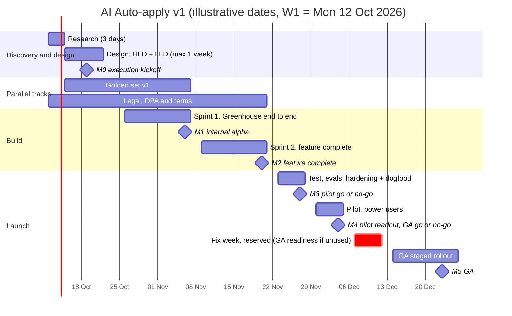
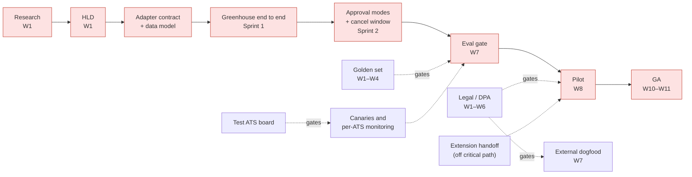

# AI Auto-apply: Implementation Roadmap and Project Plan

_Careerflow.ai Engineering Manager take-home · 7 Oct 2026_

## Summary

This plan takes AI Auto-apply from research to **general availability (GA) of v1** in about **11 weeks**, with a worst case of about **14 weeks**, using **5 engineers and an EM** (about 30% hands-on) plus borrowed design, DevOps, legal and career-coach time. v1 is the smallest version that is safe to run: Greenhouse, Lever and Ashby submits, the Chrome extension handoff, approval modes with a cancel window, guardrails and the claim verifier, a cost breaker, and per-ATS monitoring. The critical path runs research → design → adapter contract → Greenhouse end to end → approval modes → eval gate → pilot → GA. Legal/DPA work and the golden eval set run in parallel and gate the pilot. Every engineer leads one vertical, the task board has 132 rows with no ticket longer than one day, and a cut line plus a never-cut list decide what moves out if a sprint slips.

**Task board:** [Notion: "Auto-apply v1 tasks"]([NOTION LINK]), with a board view grouped by phase and a timeline view.

**How to read this document.** Sections 1–8 are the plan. Appendix A is the decision log from the planning interview and shows how the plan was reached. Dates are illustrative, with Week 1 starting Monday 12 Oct 2026. Team size and costs are **assumptions**, to be replaced with Careerflow's real numbers. The production design this plan builds is in [01-technical-design.md](01-technical-design.md).

---

## 1. Scope

### End point: GA of v1

v1 includes:

- **Submit channels:** Greenhouse, Lever and Ashby through Playwright, plus a handoff to Careerflow's Chrome extension (technical design, Section 2).
- **User controls:** approval modes, a cancel window, a global pause, and a daily digest with the funnel.
- **Onboarding:** resume parsing, a short signup preferences form (expected salary, notice period, locations and work mode, visa and relocation, deal-breakers, standard ATS answers) and a confirmation screen. Together these produce the **confirmed** profile fields that auto-submit requires.
- **Pipeline:** the shared catalog with analyse-once, a queue per stage, and the cost breaker.
- **Guardrails:** injection checks on job descriptions, PII minimisation, the claim verifier, and holding postings as `needs_you`.
- **Monitoring and the eval gate.**

**One deliberate difference from the technical design:** the design describes a conversational onboarding interview. v1 replaces it with resume parsing plus the preferences form and confirmation screen, because the form is faster to build and still produces confirmed fields. The cost is more `needs_you` holds early on, and the pilot measures this. The conversational interview moves to the post-GA roadmap.

### Post-GA roadmap (not scheduled here)

Additional ATS adapters (added continuously), the conversational onboarding interview, the agentic browser channel, MCP/API adapters, skill assessment, re-evaluating seen postings, learning loops, tiering, and a credential vault (only with a strong business case and an explicit user request). Most of these are in Section 9 of the technical design; the conversational interview is the deliberate v1 change described above.

### Starting point

The take-home prototype in this repository already exercises several v1 building blocks on Greenhouse: the merged form schema, four-source field resolution with `needs_you` holds, the code/AI split for scoring, and live status over SSE (technical design, Section 8). Its submit is simulated: it builds and stores the real payload but sends nothing. It is a reference for the design week, not production code.

---

## 2. Team requirements

**Assumption:** 5 engineers + EM. Replace with Careerflow's actual team if it differs.

| Role                            | Leads the vertical                                                                     | Key skills and notes                                                                                                                              |
| ------------------------------- | -------------------------------------------------------------------------------------- | ------------------------------------------------------------------------------------------------------------------------------------------------- |
| Backend engineer, pipeline (PL) | Ingestion, catalog, queues, cost breaker, retention and deletion                       | Skills: distributed queues, Postgres + pgvector, GCP                                                                                              |
| Backend engineer, submit (SB)   | Adapter contract, Greenhouse, Lever + Ashby (one unit), channel router, canary submits | Skills: Playwright and form automation, ATS APIs, contract testing                                                                                |
| AI engineer (AI)                | Analysis, matching, generation, verifier, guardrails, evals                            | Skills: LLM prompt and schema design, evals, guardrails. Owns eval quality, standing in for QA on AI behaviour                                    |
| Frontend engineer (FE)          | Onboarding, approval modes, cancel window, run and funnel views, holds, digest UI      | Skills: React and TypeScript, real-time UI, UX for review flows                                                                                   |
| Full-stack engineer (FS)        | Chrome extension (owner), profile service, auth, feature flags, audit log, encryption  | Skills: Chrome extension (Manifest V3), auth, KMS and encryption. Supports the other streams; pairs on AI and golden-set tooling                  |
| Engineering manager (EM)        | Plan, decisions, stakeholders, unblocking                                              | Skills: system design, delivery, stakeholder management. About 30% hands-on: adapter contract, cross-vertical reviews, a slot in the bug rotation |

**Borrowed:** a designer (~0.3), DevOps (~0.25), legal (ad hoc), career coaches (~40 hours of eval labelling), and product/founders for the pilot cohort and pricing.

**Not on the team:** a dedicated QA engineer or PM. Engineers own their tests, the AI engineer owns the evals, and career coaches do pilot acceptance.

### Ownership model

- Each engineer **leads a vertical**: the go-to owner, accountable for its internal SLA and minimum uptime.
- Every vertical has a **primary and a secondary owner**, and every system is built by **two or more people with one clear lead**.
- **Bugs and incidents go round robin across the whole team**, AI systems included, so everyone learns everyone's code.
- A **weekly off-hours rotation** means owners are not on call around the clock.

### AI-assisted development

- A versioned **AI development playbook**: shared repository skills, architecture hooks, contract guards, an AI first-pass code review with a mandatory human approver, and AI-generated test scaffolds reviewed by the owner. It is part of onboarding for new joiners.
- An **AI share-out every 1–2 weeks**, where people present what worked; adopted practices go back into the playbook. It doubles as upskilling and team-building.
- AI shortens research and build time. It does not shorten legal review, eval labelling or the pilot calendar, and the plan does not assume it does.

---

## 3. Timeline, phases and deliverables

### Why the timeline is aggressive

The timeline is deliberately aggressive. Sprint 1 was cut from 4 weeks to 2, and design from 2 weeks to 1, on the basis that AI-assisted research and build, a hard design cap, and one-day tickets keep work moving. Three safety valves protect it: the **cut line** (what moves out first if Sprint 2 slips), the **never-cut list** (what ships regardless), and an explicit **~14-week worst case** that stakeholders see from day one.

### Gantt chart

### Phases

| Phase                            | When                 | Deliverables and milestone                                                                                                                                                                                                                                                                                                                                                                                 |
| -------------------------------- | -------------------- | ---------------------------------------------------------------------------------------------------------------------------------------------------------------------------------------------------------------------------------------------------------------------------------------------------------------------------------------------------------------------------------------------------------- |
| **0. Research**                  | W1, days 1–3         | Research readout and decision memo: a form survey of about 50 ATS boards (sampling Lever and Ashby to size their variance), ATS terms summaries for legal, an LLM provider shortlist (standard DPA, zero retention), baseline interview rates, test-board options, cost inputs, extension feasibility. AI-assisted and decision-focused: enough data for the final decisions, not exhaustive research.     |
| **1. Design** (hard cap: 1 week) | W1 day 4 → W2 day 3  | HLD signed off by the EM and stakeholders in 1–2 days. LLD in 2–3 days, written in parallel by the engineers who will build each part: adapter contract, data model, queue interfaces, AI schemas, eval spec, guardrails, UX flows, observability plan, AI playbook v1, environments and CI. **M0: execution kickoff (W2).** The rest of W2 (Thursday–Friday) is LLD sign-off slack and Sprint 1 planning. |
| **Golden set** (parallel)        | W1 day 4 → W4        | About 300 postings labelled (AI pre-labelling, confirmed by career coaches), an agreement check, and must-hold form cases. **Golden set v1 frozen (W4).**                                                                                                                                                                                                                                                  |
| **Legal** (parallel)             | W1 → W6              | DPA with zero retention signed, ATS terms sign-off, user terms, privacy notice and retention policy. **Gates external dogfood and the pilot:** no real user data goes to the model before the DPA is signed.                                                                                                                                                                                               |
| **2.1 Sprint 1**                 | W3–W4                | **M1: internal alpha.** Greenhouse end to end, approval queue only, guardrails and verifier, onboarding, run view, global pause, audit log. Includes time for earlier bugs and maintenance.                                                                                                                                                                                                                |
| **2.2 Sprint 2**                 | W5–W6                | **M2: feature complete.** Lever + Ashby, extension handoff, approval modes, cancel window, digest, retention and deletion, monitoring and canary submits, eval runners, shadow mode. First retro.                                                                                                                                                                                                          |
| **3. Test, evals, hardening**    | W7 (W8 worst case)   | **Testing report:** eval gate results, security review, load test at 10× pilot volume, end-to-end tests across the 3 ATSs and the extension, runbooks, quality analysis. Dogfood with about 10 users. A lighter load, so the team starts planning the next feature set. **M3: pilot go/no-go.**                                                                                                            |
| **4. Pilot**                     | W8, then W9 reserved | Power users offered a beta, ramped from 50 to 200, with daily gate reviews and pilot data saved into the eval sets. Rollback on any critical failure. W9 is reserved: a fix week if the pilot needs one, otherwise GA readiness. **M4: pilot readout and GA go/no-go.**                                                                                                                                    |
| **5. GA**                        | W10–W11              | Staged rollout to 10 → 25 → 50 → 100% of users, each step held at least 48 hours (14, 16, 21 and 23 Dec on the board). **M5: GA.**                                                                                                                                                                                                                                                                         |

**Total:** about 11 weeks in the base case, which already reserves W9 as a fix week. The worst case is about 14 weeks: one more hardening week, at most one pilot extension week, and a second fix week after an extended pilot.

**The pilot and the free trial.** The technical design offers pilot users a free two-week trial (technical design, Appendix A.1). The engineering pilot phase above is the one-week gate before GA; trial users continue through the reserved W9 (their second trial week) into GA. A one-week pilot cannot measure interviews, since employers take 1–3 weeks to respond, so the go/no-go uses leading indicators (Section 6). The pilot is extended by one week only when those indicators are ambiguous rather than failing, and at most once.

### Code review and testing deliverables

- Every pull request gets an AI first-pass review and a mandatory human approver.
- Each sprint, the EM reviews cross-vertical changes to the adapter contract and the data model.
- A whole-branch review happens before M3.
- The testing report at M3 (above) is the formal testing deliverable; evals are re-run on every model or prompt change and in shadow mode before promotion.

---

## 4. Dependencies and critical path

- **Critical path:** research → HLD → adapter contract + data model → Greenhouse end to end (Sprint 1) → approval modes + cancel window (Sprint 2) → eval gate → pilot → GA.
- **Parallel tracks that become critical if late:** legal/DPA (blocks the pilot), the golden set (blocks the W7 eval gate), and the test ATS board (blocks canary submits and per-ATS monitoring).
- **Off the critical path:** the extension handoff. If it is late, ATSs it would have covered get an Apply button instead.

### Cut line and never-cut list

Lever and Ashby are built together as **one unit by one owner** (the submit lead): the work is similar and it is one system. If Sprint 2 slips, cuts are made in this order:

1. The Lever + Ashby unit moves after GA. If only one of the two passes its canary, that one ships.
2. The daily digest is reduced to the in-app funnel.
3. The extension handoff moves after GA.

**Never cut:** guardrails and the verifier, the cancel window, the global pause, the cost breaker, and per-ATS monitoring.

---

## 5. Resource planning

Order-of-magnitude figures, labelled as **assumptions** and verified in research week. USD at the technical design's assumed ₹88 = US$1.

| Item                 | Choice                                                                                      | Pilot cost (assumption)                                                               |
| -------------------- | ------------------------------------------------------------------------------------------- | ------------------------------------------------------------------------------------- |
| LLM API              | A provider with a standard DPA and zero retention, behind the provider-swappable interface  | Budget about ₹2.5 lakh (~$2,800), alert at 70%, the ₹80 per user per day breaker kept |
| Browser workers      | Playwright in short-lived, scale-to-zero containers on GCP                                  | ~₹20–40k/month (~$230–450)                                                            |
| Data                 | Firestore, Postgres + pgvector (minimal tier), object storage, BigQuery                     | ~₹25–40k/month (~$280–450)                                                            |
| Queues               | Pub/Sub + Cloud Tasks (proposed; final choice follows Careerflow's existing infrastructure) | Small                                                                                 |
| Guardrails framework | LangChain for retrieval and guardrails at three points (technical design, Section 3)        | Open source; runs on the LLM budget above                                             |
| Observability        | Error tracking, tracing, dashboards and alerts                                              | ~₹10–20k/month (~$110–230)                                                            |
| AI development tools | Team seats for 6                                                                            | ~₹50k–1 lakh/month (~$570–1,140)                                                      |
| Task management      | Notion (board and timeline views)                                                           | Existing                                                                              |
| Test ATS board       | Our own careers board, a vendor sandbox, or a partnership                                   | Decided in research; tracked as a risk                                                |
| People               | Section 2: 5 engineers, EM, borrowed design, DevOps, legal, career coaches                  | Existing headcount                                                                    |

### Early cost per user

Per-user cost starts near the ₹80/day ceiling and falls toward the ₹30 design target (technical design, Section 4) as usage grows. Early on, few users share each analysed posting, power users are heavier than average, and fixed costs don't shrink; meanwhile users arrive gradually. The plan takes a middle path: a pilot LLM budget of about ₹2.5 lakh with a 70% alert, the per-user breaker kept, cohort ramps, and infrastructure that scales to zero. Cost per user per day is reported alongside **users per analysed posting** (the amortisation ratio), so the trend toward the target is visible.

---

## 6. Rollout, gates and kill criteria

### Stages

1. **Dogfood (W7):** the team plus about 10 users, approval queue only.
2. **Pilot (W8):** power users, ramped from 50 to 200. Auto-submit only on APPLY NOW, with the cancel window; the default mode is auto-approve after a timer.
3. **GA (W10–W11):** 10 → 25 → 50 → 100%, each step held at least 48 hours.

### Go/no-go gates

- Submit success rate ≥ 95% on each ATS.
- Zero unconfirmed factual fields submitted.
- Cancels plus overrides ≤ 10% of auto-submits.
- Holds resolved within 48 hours for most users (hold rate tracked).
- Cost within the pilot budget curve.
- No open critical security findings.

### Kill and rollback

| Trigger                                                                                                              | Action                                                                                                                                               |
| -------------------------------------------------------------------------------------------------------------------- | ---------------------------------------------------------------------------------------------------------------------------------------------------- |
| A fabricated claim is submitted, a data leak, or a platform terms notice or block                                    | Global pause immediately                                                                                                                             |
| Submit success < 80% on any ATS                                                                                      | Disable that ATS channel and fall back to one-tap apply                                                                                              |
| After GA, interview rate per application clearly below users' manual baselines over 4–6 weeks, with a minimum sample | Revert the default to approval-only. Without enough data, use proxies (employer response rate, 14-day check-in outcomes), never the north star alone |

### Metrics

- **North star:** interviews per active user per week. **Directional only**, because attribution may never be complete.
- **Business:** pilot-to-paid conversion.
- **Operational:** submit success per ATS, override and cancel rate, time to resolve holds, cost per user per day, amortisation ratio.

---

## 7. Task management

**Board:** [Notion: "Auto-apply v1 tasks"]([NOTION LINK]), a database with a board view grouped by phase and a timeline view (start to end).

- **Fields:** Task, Ticket, Phase, Owner (lead), Pairs with, Start week, Points, Depends on, Start, End, Status.
- **Sizing:** story points on the Fibonacci scale: 1 point is up to 2 hours, 2 up to half a day, 3 up to a day. **No ticket is longer than one day**; anything bigger is split.
- **Capacity per sprint:** 5 engineers × 10 days = 50 dev-days, minus 10% for ceremonies and 20% for bugs and maintenance = 35 dev-days, plus about 2 EM days of ticket work (the rest of the EM's ~30% hands-on time goes to reviews and the bug rotation) = 37 days × 3 points ≈ 111 points. Planned commitment is 83–93 points (Sprint 1 = 93, Sprint 2 = 83). The buffers are reserved capacity rows on the board, not tickets.
- **Size:** 132 rows: Research 9, Design 13, Golden set 10, Legal 5, Sprint 1 36, Sprint 2 34, Hardening 11, Pilot 7, GA 7.
- **Dates:** illustrative, from Week 1 = Monday 12 Oct 2026, generated by a scheduler that respects dependencies and each lead's capacity of 3 points a day.

### Capacity rebalancing by the scheduler

While generating dates, the scheduler rebalanced work to keep each lead within capacity and each sprint inside its boundaries. The author has reviewed and accepted these changes:

- **AI engineer over capacity in W2–W4:** G2 (pre-labelling pipeline) → FS with AI; G8 (must-hold cases) → SB with AI; G9 (agreement check) → EM with career coaches; S1-13 (PII minimisation) and S1-16 (eval harness skeleton) → FS with AI.
- **Observability and flags:** S1-33 (tracing) led by DevOps with FS; S2-26 and S2-27 (alerts) led by DevOps with PL; S2-28 (cost dashboard) → FS with PL; S2-31 (feature flags) → FE with FS.
- **Frontend unblocked early:** S1-26, S1-27 and S1-28 (approval queue, run view, holds UI) depend on the data model and AI schemas rather than on finished backend tickets. They are built against the contracts and integrated at the M1 demo.
- **Rollout spacing:** GA steps at least 48 hours apart (14, 16, 21 and 23 Dec); the pilot gate review spans the pilot week, with the readout on its Friday.

---

## 8. Leadership and execution

### Moving into execution

The kickoff happens right after the HLD (W2). It names the lead and secondary for each vertical, agrees the definition of done (tests, evals where relevant, a dashboard for the vertical, a runbook entry), states the cut line and the never-cut list, and hands over AI playbook v1. Design ends fully documented, so execution starts without open questions.

### Rituals

| Cadence         | Ritual                                                                                                                                                |
| --------------- | ----------------------------------------------------------------------------------------------------------------------------------------------------- |
| Daily           | Standup, 30 minutes, 5 minutes per person: yesterday, today, blockers                                                                                 |
| As needed       | Blocker sync with only the people involved, at most 30 minutes; the resolution is posted on the team Slack so the unblock doesn't cause another block |
| Weekly          | A demo from each engineer; a stakeholder update (or per the agreed SLA); a critical-path review                                                       |
| Every 1–2 weeks | AI share-out                                                                                                                                          |
| Each sprint     | Planning; retros from Sprint 2 onward (Sprint 1 is too short to yield enough)                                                                         |

### Unblocking

- If the **EM is the blocker, unblocking is the top priority**, and the engineer switches to other work meanwhile.
- A blocker open for more than one working day goes to the EM; more than two days goes into the stakeholder update.
- Anything critical is raised with stakeholders early, so they help choose the response (for example, a feature cut) instead of hearing about a missed date.

### Decision-making

The EM does not start from fixed opinions: they understand the problem, gather full context, discuss it with the people involved, and then choose the best path.

| Decision                                                               | Owner                                  | How                                              |
| ---------------------------------------------------------------------- | -------------------------------------- | ------------------------------------------------ |
| Inside a vertical                                                      | Vertical lead                          | Recorded in the decision log; secondary informed |
| Cross-vertical (adapter contract, shared data model, queue interfaces) | EM with the affected leads             | 24-hour timebox; recorded as an ADR              |
| Cuts within the cut line                                               | EM                                     | Same day; stakeholders informed                  |
| Cuts beyond the cut line, date changes, go/no-go                       | EM recommends; founders/product decide | Raised early, with options                       |
| Legal, ATS terms, data policy                                          | Legal sign-off                         | Never overridden for schedule                    |

Reversible decisions are made by the owner without a meeting. Disagreements are argued within the timebox, then the team disagrees and commits.

### When something slips

- Cut risk is raised before the date is missed, and the cut order is applied the same day it is decided.
- No people are added mid-sprint.
- The pilot is extended only on ambiguous indicators, and by one week at most.
- Slips and weak systems get a "why" analysis in hardening week and in retros, and the cause is fixed, not just the symptom.

### Adaptability

The plan is built to absorb change: one-day tickets keep progress visible, the weekly critical-path review catches drift within a week, the cut line turns schedule pressure into a pre-agreed scope decision, and the round-robin bug rotation means no vertical depends on one person.

---

## Appendix A: Decision log

The decisions below come from the planning interview with Claude (the transcript is shared in the Responsible Use of AI statement). Decisions are the author's; Claude proposed options with a recommendation and pushed back where noted.

| #   | Topic                   | Decision                                                                                                                                                                                                                                                                                                                      | Pushback or refinement                                                                                                                                             |
| --- | ----------------------- | ----------------------------------------------------------------------------------------------------------------------------------------------------------------------------------------------------------------------------------------------------------------------------------------------------------------------------- | ------------------------------------------------------------------------------------------------------------------------------------------------------------------ |
| 1   | End point               | The plan runs to **GA of v1**. Section 9 of the technical design is a post-GA roadmap, not scheduled work. New ATS platforms are added continuously after GA as adapters.                                                                                                                                                     | Author: v1 is the bare minimum, **including guardrails and monitoring** (Claude's first scope list had left them implicit).                                        |
| 2   | Onboarding              | The conversational interview is dropped from v1, replaced by **resume parsing + a short signup preferences form** + a confirmation screen, which together produce the confirmed fields auto-submit needs.                                                                                                                     | Claude: something must still produce _confirmed_ fields; expect more `needs_you` holds early, which the pilot measures.                                            |
| 3   | Team                    | **5 engineers + EM**: pipeline backend, submit backend, AI engineer, frontend, full-stack (supports all streams and **owns the extension**). EM ~30% hands-on. Borrowed: designer ~0.3, DevOps ~0.25, legal ad hoc, career coaches (~40h labelling), product/founder for the pilot cohort and pricing. No dedicated QA or PM. | Author rejected a separate extension engineer in favour of the fifth, full-stack engineer. Team size stated as an assumption.                                      |
| 4   | Ownership               | Each engineer **leads a vertical** and is accountable for its internal SLA and minimum uptime. Every vertical has a **primary and secondary owner**; every system is built by **2+ people with one clear lead**. **Bugs and incidents go round robin across the whole team, AI systems included.**                            | Claude added a weekly off-hours rotation so owners aren't on call 24/7.                                                                                            |
| 5   | AI-assisted development | A versioned **AI development playbook**, part of onboarding. **AI share-out every 1–2 weeks**; adopted practices go back into the playbook.                                                                                                                                                                                   | Claude: AI compresses research and build, not legal review, eval labelling or the pilot calendar; the plan says so.                                                |
| 6   | Research                | **2–3 days, AI-assisted, decision-focused.**                                                                                                                                                                                                                                                                                  | Author cut Claude's 2-week estimate.                                                                                                                               |
| 7   | Golden set              | A **separate parallel process**, starting once research defines what's needed; results needed after ~3 weeks (eval gate).                                                                                                                                                                                                     | —                                                                                                                                                                  |
| 8   | Design                  | **Max 1 week (hard cap):** HLD in 1–2 days by the EM and stakeholders; LLD in 2–3 days, in parallel, by the engineers who will build it.                                                                                                                                                                                      | Author cut Claude's 2-week estimate.                                                                                                                               |
| 9   | Sprint 1                | **2 weeks**, including testing and time for earlier bugs. Increment 1 = Greenhouse end to end, approval queue only, guardrails + verifier.                                                                                                                                                                                    | Author cut Claude's 4-week estimate.                                                                                                                               |
| 10  | Sprint 2                | **2 weeks**: increment 2 plus bugs and learnings from Sprint 1.                                                                                                                                                                                                                                                               | —                                                                                                                                                                  |
| 11  | Hardening               | Testing, evals and improvements: **1 week, 2 worst case**. Only low-quality systems get a "why" analysis; delays are fixed at the root.                                                                                                                                                                                       | —                                                                                                                                                                  |
| 12  | Retros                  | After every sprint **from Sprint 2 onward**.                                                                                                                                                                                                                                                                                  | —                                                                                                                                                                  |
| 13  | Pilot                   | **1 week** with power users as a beta, constant observation, data saved for evals; rollback on critical failure. **+1 fix week** only if needed. **Extendable.**                                                                                                                                                              | Claude: a 1-week pilot can't measure interviews, so go/no-go uses leading indicators. Extend by one week only on ambiguous (not failing) indicators, at most once. |
| 14  | GA                      | Staged rollout over 2 weeks.                                                                                                                                                                                                                                                                                                  | Agreed as proposed.                                                                                                                                                |
| 15  | Legal / DPA             | Starts day 1 in parallel; gates the pilot (no real user data to the model before the DPA is signed). Shortlist only providers with a standard DPA and zero retention.                                                                                                                                                         | Claude pushback, accepted.                                                                                                                                         |
| 16  | Critical path           | research → HLD → adapter contract + data model → Greenhouse end to end (S1) → approval modes + cancel window (S2) → eval gate → pilot → GA.                                                                                                                                                                                   | Agreed.                                                                                                                                                            |
| 17  | Cut line                | **Lever + Ashby as one unit by one owner.** Cut order if S2 slips: Lever + Ashby → digest reduced to in-app funnel → extension handoff. **Never cut:** guardrails and verifier, cancel window, global pause, cost breaker, per-ATS monitoring.                                                                                | Author changed Claude's proposal (separate Ashby then Lever) to one combined unit. Research samples Lever/Ashby forms to size variance.                            |
| 18  | Resources               | Order-of-magnitude INR line items, labelled as assumptions verified in research week.                                                                                                                                                                                                                                         | Agreed.                                                                                                                                                            |
| 19  | Early cost              | Early per-user cost is higher and users arrive gradually. **Middle path:** pilot LLM budget ~₹2.5L with a 70% alert, ₹80/day breaker kept, cohort ramps, scale-to-zero infra. Report cost per user per day with **users per analysed posting**.                                                                               | Raised by the author; Claude first proposed budgeting at the ₹80 ceiling (~₹3–3.5L).                                                                               |
| 20  | Daily standup           | **30 min, 5 min per person.**                                                                                                                                                                                                                                                                                                 | Author's format.                                                                                                                                                   |
| 21  | Blockers                | Max 30-min sync; **resolution posted on the team Slack**. If the **EM is the blocker, unblocking is top priority**.                                                                                                                                                                                                           | Claude added: >1 working day escalates to the EM; >2 days goes into the stakeholder update.                                                                        |
| 22  | Demos and stakeholders  | **Weekly demo per engineer.** Stakeholder update weekly or per SLA; **critical things raised early**.                                                                                                                                                                                                                         | —                                                                                                                                                                  |
| 23  | Decision rights         | As in Section 8. Reversible decisions by the owner without a meeting; disagree and commit after the timebox.                                                                                                                                                                                                                  | Agreed ("standard").                                                                                                                                               |
| 24  | EM decision style       | Understand the problem, gather full context, discuss, then choose the best path.                                                                                                                                                                                                                                              | Author's own approach.                                                                                                                                             |
| 25  | Rollout and gates       | Stages, gates and kill criteria as in Section 6.                                                                                                                                                                                                                                                                              | Agreed.                                                                                                                                                            |
| 26  | North star              | Interviews per active user per week is **directional only**. The post-GA kill criterion uses proxies with a minimum sample, never the north star alone.                                                                                                                                                                       | Author's point, already in the technical design.                                                                                                                   |
| 27  | Tickets                 | Fibonacci story points. **No ticket longer than 1 day.** Ticket count derived from 5 engineers + 30% EM + a buffer for earlier bugs.                                                                                                                                                                                          | Author's rule.                                                                                                                                                     |
| 28  | Board scheduling        | The scheduler rebalanced owners and dates to fit capacity (Section 7).                                                                                                                                                                                                                                                        | Made during scheduling, not in the interview; reviewed and accepted by the author.                                                                                 |
